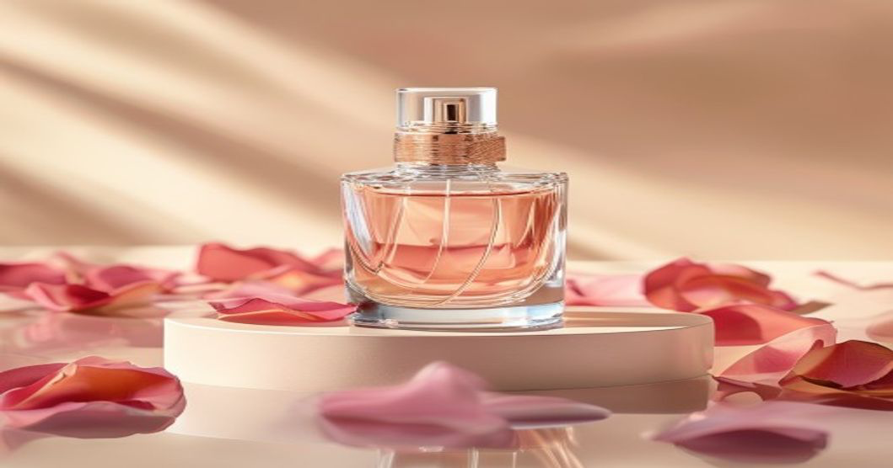
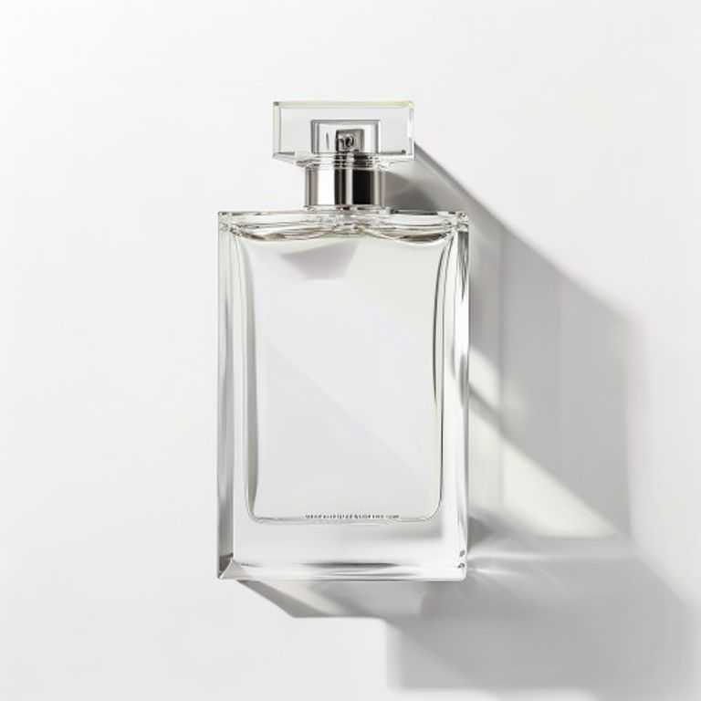

# AI Perfume Product Photography Prompts

> TDH: AI perfume product photography prompts | skincare product image prompts | cosmetic ecommerce product photo prompts

A vertical prompt library for AI perfume product photography, skincare bottle images, cosmetic ecommerce photos, white background product shots, social media covers, website hero images and Seedance ASMR product videos.

This repository is built as a standalone SEO/GEO asset: clear title, description, H1, keyword-focused image filenames, real preview images, copy-paste prompts, structured JSON and a CSDN-ready Chinese article.



## SEO TDH

Title:

```text
AI Perfume Product Photography Prompts: 18 Templates for Perfume, Skincare and Cosmetic Product Images
```

Description:

```text
Copy-paste AI prompts for perfume product photography, skincare bottle images, cosmetic ecommerce photos, white background product shots, social covers and Seedance ASMR videos.
```

H1:

```text
AI Perfume Product Photography Prompts
```

## Image Examples

| Perfume product photography cover | White background product image |
| --- | --- |
|  |  |

## What You Get

- Copy-paste perfume product photography prompts.
- Skincare bottle and cosmetic ecommerce image prompts.
- White background product image prompts.
- Xiaohongshu/social cover prompt direction.
- Seedance ASMR product video prompt.
- Chinese CSDN article draft for distribution.
- Structured JSON for reuse in tools and content workflows.

## Start Here

- [中文 README](README.zh-CN.md)
- [Chinese prompt pack](prompts/zh/perfume-product-photography.md)
- [Structured prompt data](data/prompts.zh.json)
- [CSDN article draft](docs/csdn-article.md)
- [SEO TDH notes](docs/seo-tdh.md)

## Copy This Prompt First

```text
生成一张 1:1 香水白底商品主图，主体是[香水名称/瓶型]，瓶身居中完整可见，瓶盖、喷头、标签和玻璃边缘清楚。背景为纯白或浅灰无缝棚拍背景，台面干净，产品下方有自然接触阴影。使用柔和大面积主光和轻微边缘光，突出玻璃反光和液体通透感。产品占画面约 70%，不要添加道具、文字、水印或随机品牌 logo。
```

## Prompt Formula

```text
[product type] + [bottle shape and material] + [use case] + [surface/background] + [lighting] + [composition] + [details to preserve] + [negative constraints]
```

## LemGen

Explore more AI image and video prompts:

https://lemgen.org

## License

CC BY 4.0
